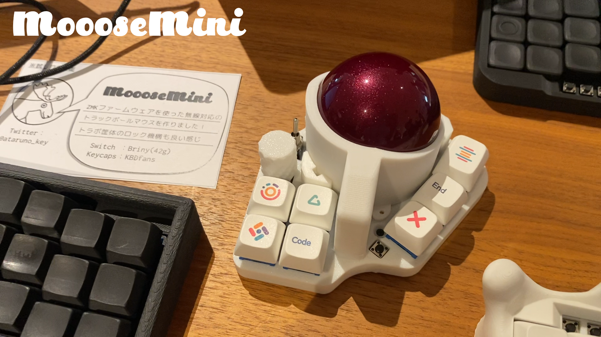

 
# MoooseMini
55mm大玉搭載の自作マウス"MoooseMini"のプロジェクトリポジトリです。  
※画像は開発中の物であり、製品版とはわずかに外観が異なる可能性があります。  

## 特徴
・ZMK Firmware採用で有線/無線可能
・ZMK Studio対応
・ロータリーエンコーダ対応
・最大8キー(MX互換)+1タクトスイッチ
・55mmトラックボールもキットに同梱予定
・ロック機能付きトラボ筐体

## 詳細
[販売ページ](https://ataruno.booth.pm/items/6922285)
ビルドガイド
[ZMK-Configリポジトリ](https://github.com/ataruno/zmk-MoooseMini)

## キット内容
* MoooseMini基板 x 1
* 電源スイッチ(トグルスイッチ) x 1
* 電源コネクタ x 1
* タクトスイッチ x 2
* 本体ケース x 1 (※トラボ支持球3つも同梱されます)
* 55mmトラックボール
* トラックボールセンサ(PMW3610+光学レンズ)＆周辺部品
* ロータリーエンコーダノブ
* 各種ネジ、スペーサ

## ご自身で用意いただくもの
※ある一つの構成例です。
* Xiao BLE
* リチウムイオンバッテリー

## 注意点
* ご自身ではんだ付けが必要な組み立てキットです。
* 本体ケースなどは家庭用3Dプリンターにて出力したものです。寸法公差、カケ、汚れなどがある場合があります。ご了承ください。(商品になると判断したものを在庫追加いたします。)
* 電源構成はご自身でご検討ください。仮にリチウムイオンバッテリーを使用する場合は取り扱いに十分に気を付けてください。  
https://www.baj.or.jp/battery/safety/safety16.html
* 本キーボード自作キットを使用した際のいかなる損害についても、開発者は責任を負いかねます。

## キーマップの変更について
方法は2種類あります。

### ZMK Studioを使用する場合
USB接続した上で＊＊＊にアクセスしてください。
Webブラウザ上で完結するためキーマップを簡単に編集可能です。

### ZMK Firmwareを使用する場合
MoooseMiniのZMK FirmwareのGithubリポジトリをForkしてください。
Github上でキーマップを編集しコミットすると、Github Action上でビルドされ書き込みファイルが生成されます。

### FIRMWARE  
Special thanks to the people behind the ZMK project:  
- [Pete Johanson](https://github.com/petejohanson)  
- [Cem Aksoylar](https://github.com/caksoylar)  
- And all the [ZMK Contributors](https://github.com/zmkfirmware/zmk/graphs/contributors)

