## 構成
### ケース(キットに含まれます)
  1.ケースメイン部  
  2.ケース背面部  
  3.トラボ筐体(※トラボ支持球3つもキットに同梱されます)  
  4.トラボカバー  
  5.バッテリ側面カバー  
  6.電源スイッチカバー  

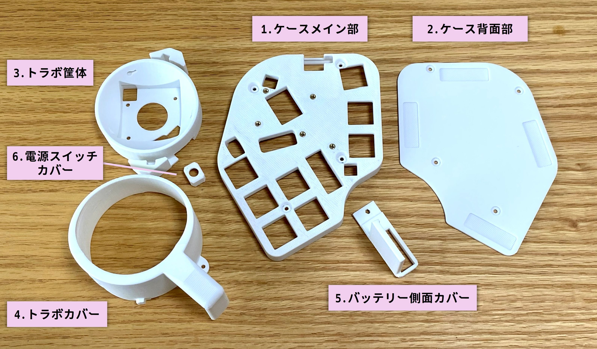

### 基板(キットに含まれます)
* MoooseMini基板 x 1
* トラックボールセンサ(PMW3610+光学レンズ)＆周辺部品
* 
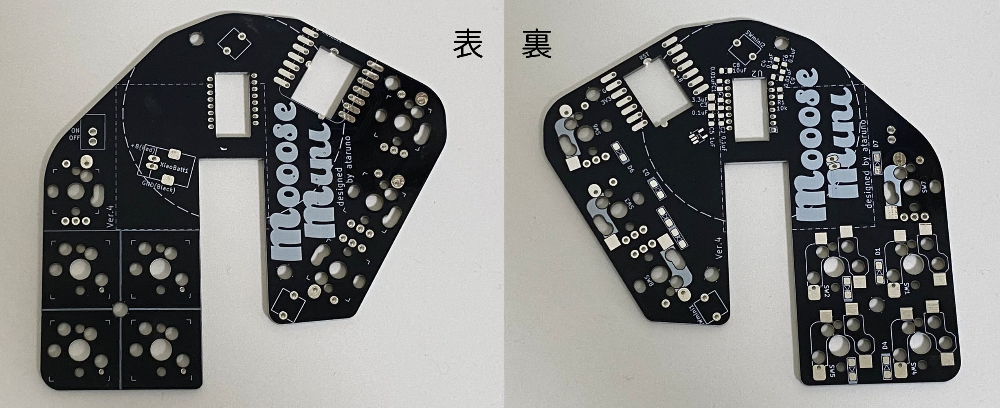

光学センサや周辺部品ははんだ付け済みです。  
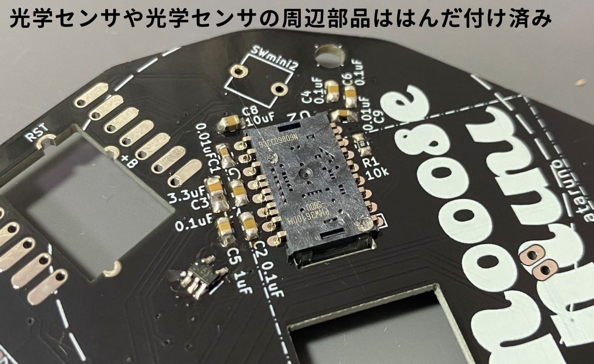

### その他パーツ
#### キットに含まれるもの
* 電源スイッチ(トグルスイッチ) x 1  
* バッテリー端子  
* 55mmトラックボール x 1 (有り版/無し版用意するかも)  
* 各種ネジ、スペーサ

#### ご自身で購入いただくもの
* Xiao ble nRF52840 x 1  
* MX互換キースイッチソケット x 最大8個  
* ダイオード(表面実装) x 9  
* リセットスイッチ x 1  
* タクトスイッチ x 1  
* ロータリーエンコーダノブ(任意)
* お好きなキースイッチ  x 最大8個  
* リチウムイオンバッテリー(※無線にする際の構成例)

参考：以下は主要部品です。  
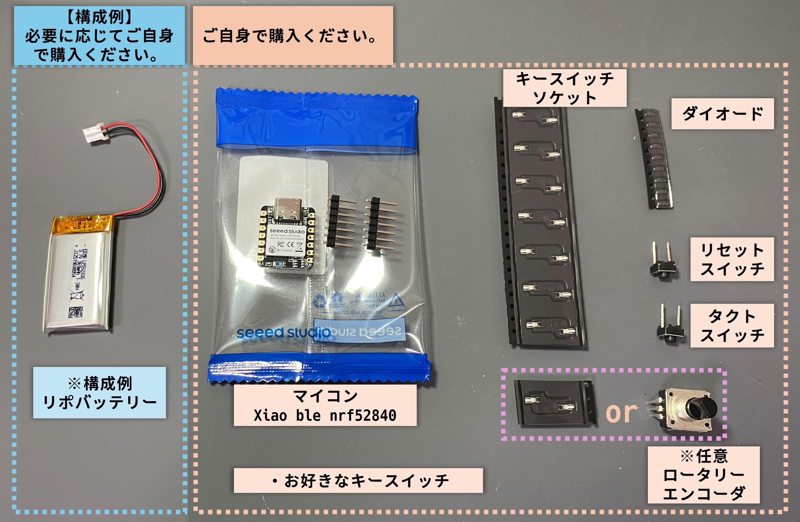

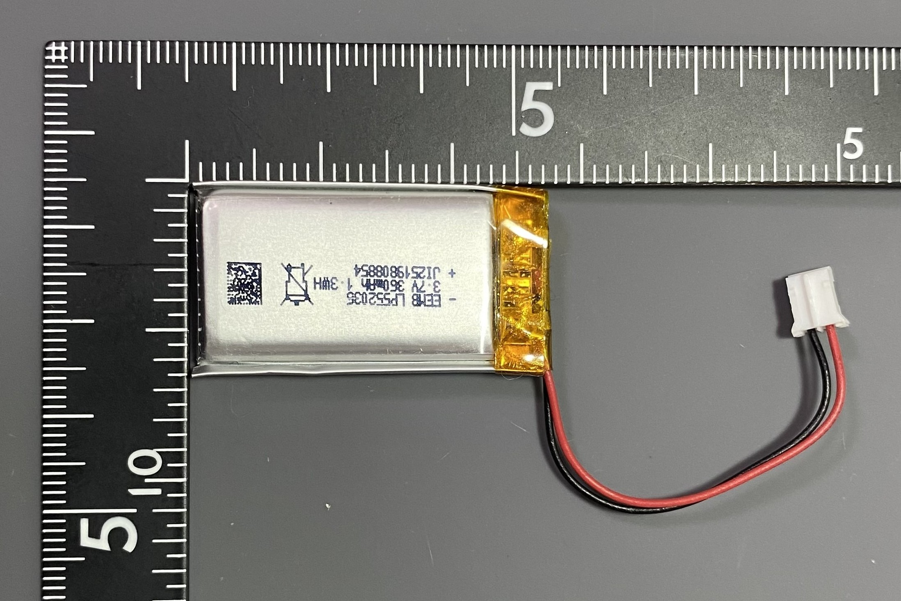

### はんだ付け
#### マイコン(Xiao)の下準備
マイコンには購入したときにピンヘッダが付属されていると思います。  
これは位置合わせに使用します。  

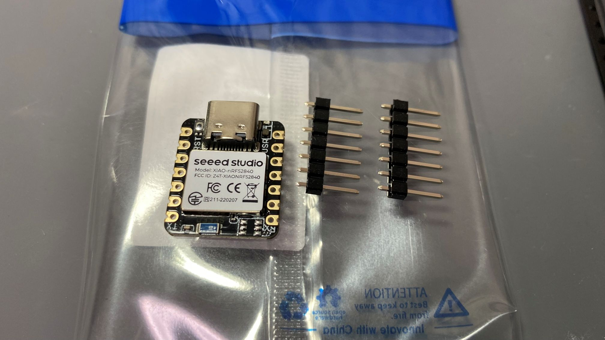

まずXiaoの背面の一部をカプトンテープで絶縁します。  
無しでも大丈夫な基板設計にしていますが、はんだ付けに自信がない方は(ある方も)ぜひ貼ってください。  
バッテリー短絡やリセットスイッチの短絡を防ぎましょう  
適当なサイズにはさみなどでカットしてください。  
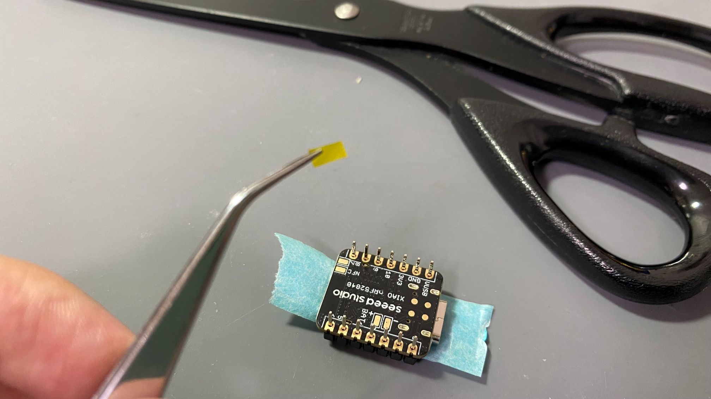

以下の画像のように貼ってください。  
画像では長方形を3枚貼りました。  
(青色のマスキングテープは後述しますので、今は無視してください。)  
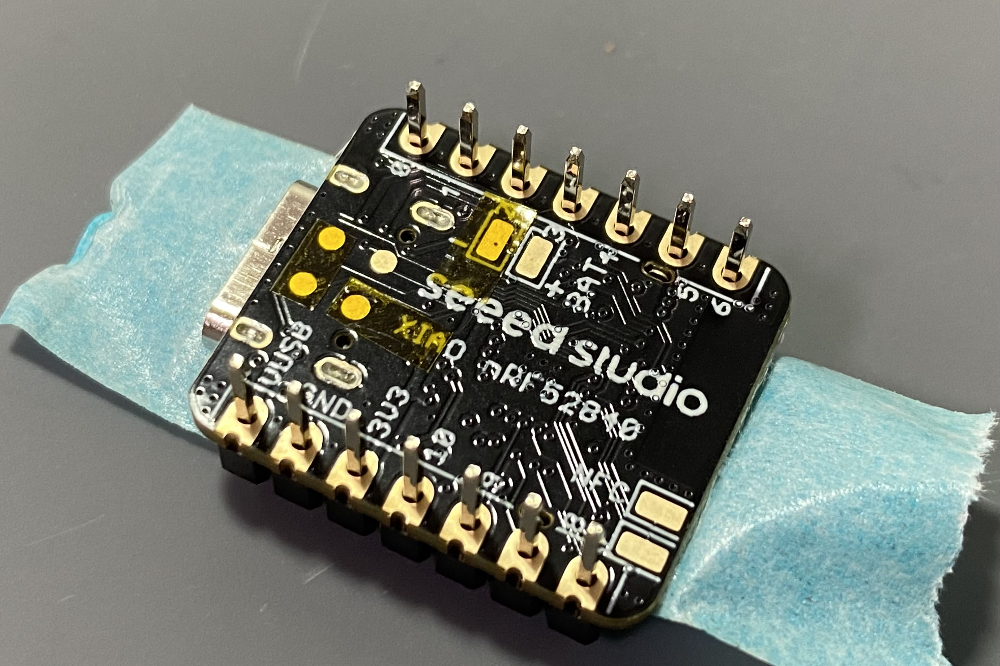
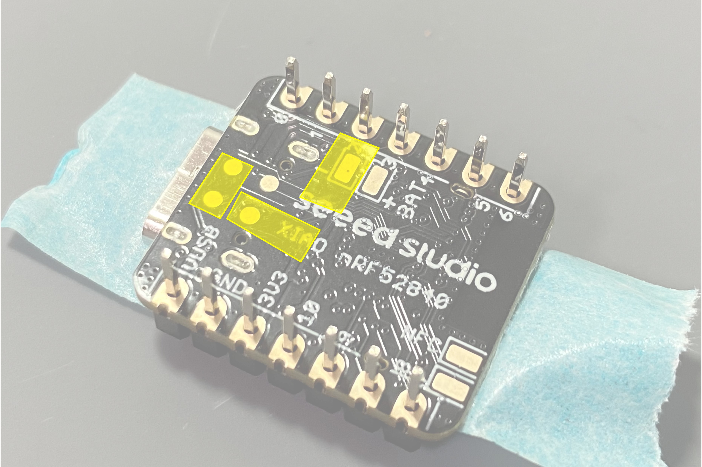

基板の表面、光学センサのレンズがある側にXiaoをはめます。  
付属するピンヘッダを使って位置合わせをします。  
位置合わせだけですのでピンヘッダははんだ付けしないでください！  
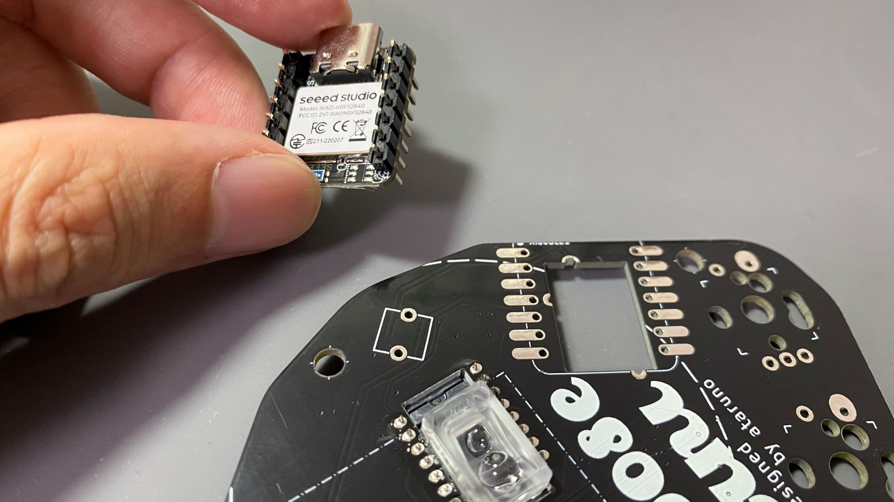

ピンヘッダで位置を合わせたら  
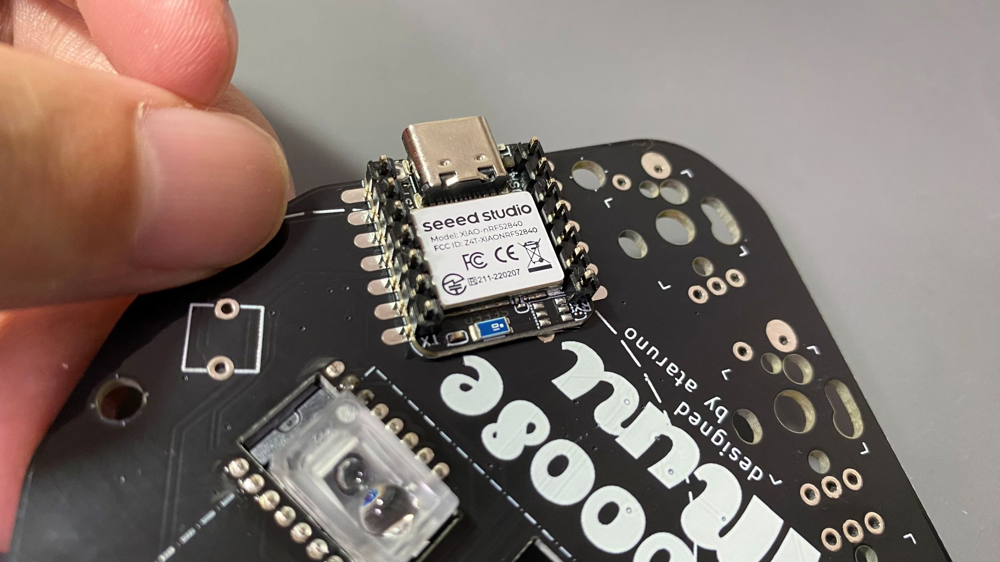

マスキングテープなどで固定してください。  
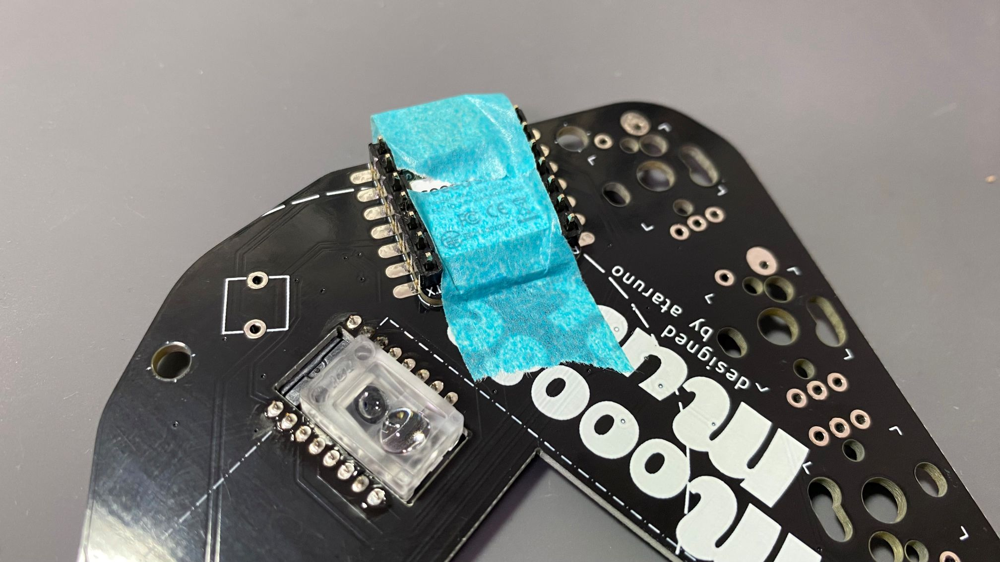

ひっくり返して裏面から見るとこうなっているはず。  
背面のパッド3か所をはんだ付けします。  
はんだ付けのコツは傾けて重力を活用し、パッドから端面スルーホールに滑らせるようにする点。  
分かりにくいかと思うので動画にします。  
(※後からリンクを記載する)
繰り返しますがピンヘッダははんだ付けしないでください。  
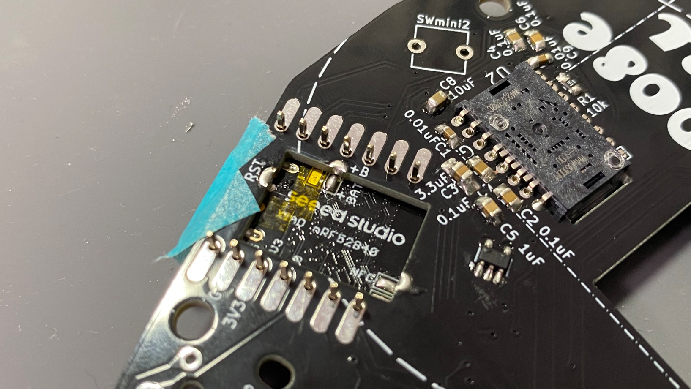

バッテリ+パッドのはんだ付け。  
カプトンテープもあり隣のバッテリ-パッドとショートはしないはずです。  
はんだ付けしやすいように穴もがっつり空けています。  
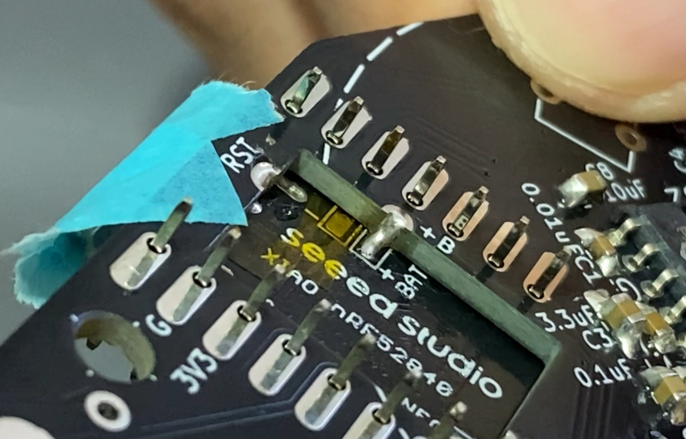

同じ要領でRST、NFCもはんだ付けしてください。

### バッテリ端子
基板の表面にバッテリ端子をはんだ付けします。  
まず、固定用パットの片側にはんだを盛ってください。  
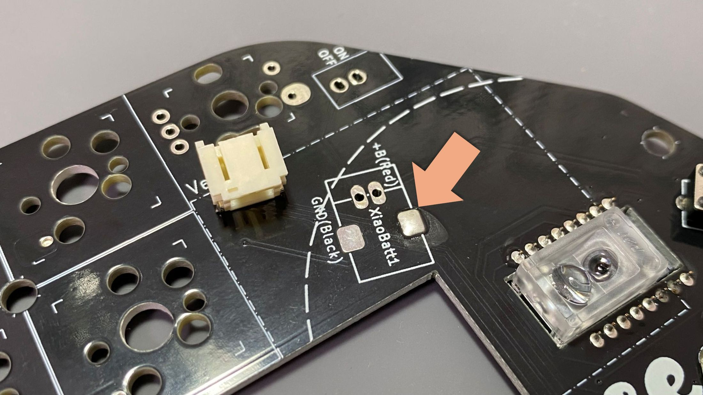

片側をはんだ付けします。  
このとき、位置・向きがずれないようにしてください。  
はんだ付けできたら反対側の固定用パットもはんだ付けしてください。  
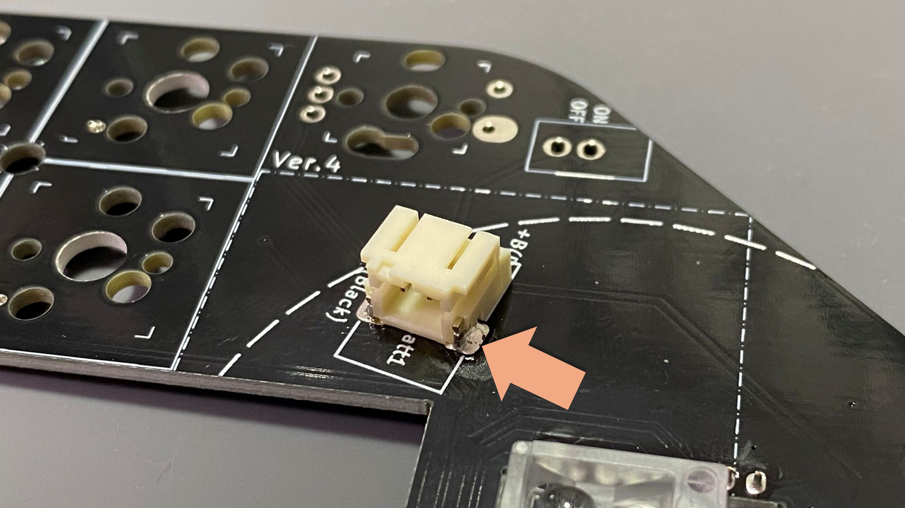

裏側を向けて端子2か所をはんだ付けします。  
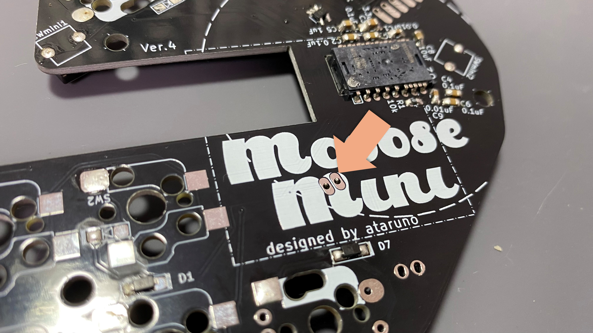

## キーマップの変更について
方法は2種類あります。  

### ZMK Studioを使用する場合
USB接続した上で https://zmk.studio にアクセスしてください。  
Webブラウザ上で完結するためキーマップを簡単に編集可能です。  

### ZMK Firmwareを使用する場合
MoooseMiniのZMK FirmwareのGithubリポジトリをForkしてください。  
Github上でキーマップを編集しコミットすると、Github Action上でビルドされ書き込みファイルが生成されます。  