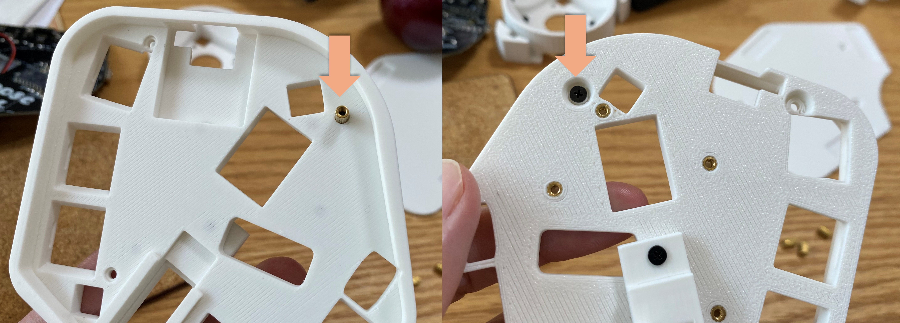
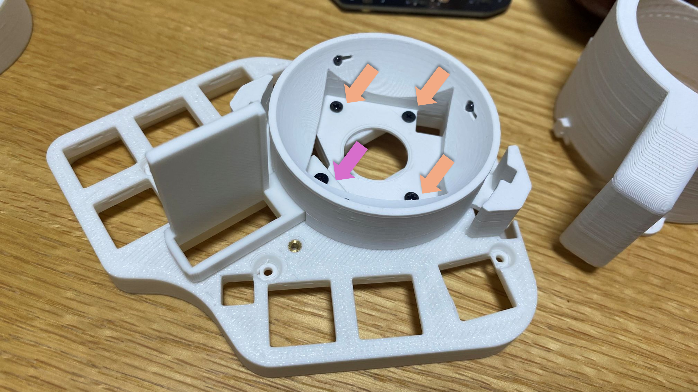
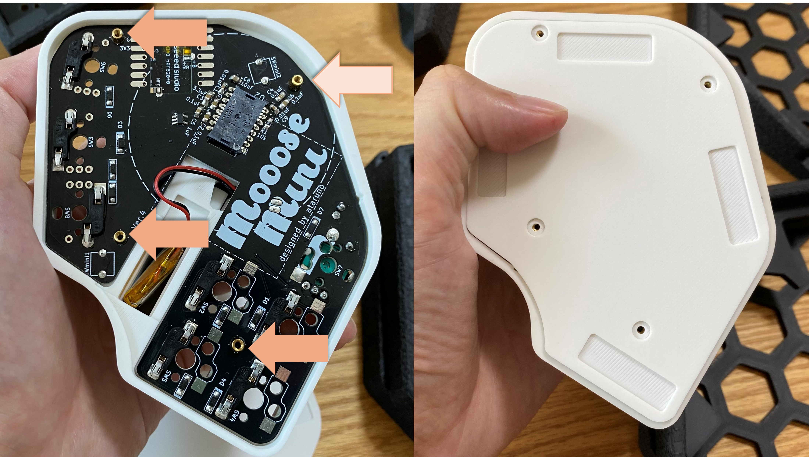
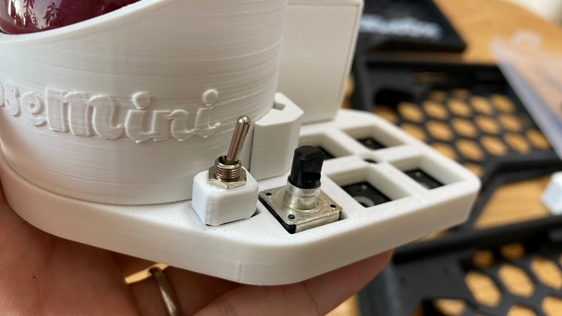
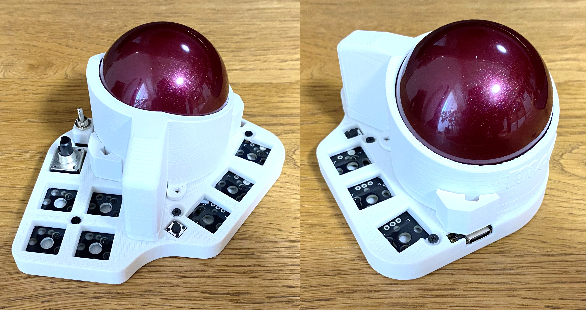

# MoooseMiniのビルドガイド
## 目次
- [目次](#目次)
- [構成](#構成)
- [はんだ付け](#はんだ付け)
- [ケース組み立て](#ケース組み立て)
- [ソフト書き込み](#ソフト書き込み)

## 構成
### キット内容一覧
Mustで含まれるものと、オプションで選択可能なものがあります。
※一覧の後に写真があります。

#### キットに含まれるもの
| キットに含まれるもの    | 個数            |
| :-------------------------- | :-------------- |
| ケース一式(トラボ支持球含む) |  1セット |
| 基板                         |  1個 |
| 光学センサと周辺部品         |  1セット |
| シリコンチップ               |  1個 |
| 電源スイッチ(トグルスイッチ) |  1個 |
| 電源スイッチカバー           |  1個 |
| バッテリー端子               |  1個 |
| ネジ(M2x7mm)                 |  1個 |
| ネジ(M2x4mm)                 | 12個 |
| ナット(M2用x5mm)             |  4個 |
| カプトンテープ | カットして使用 |
| 滑り止めシート | カットして使用 |
| エンコーダノブ | 1個 |

#### オプション
Booth購入画面のオプションでキットに含むか選択ください。  
※55mmトラックボール x 1 (有り版/無し版あり。色は赤ですが、どこかで黒にするかも。)  
※Xiao ble nRF52840 x 1  (当面は付けます)  

### ご自身で購入いただくもの(リンクは例です。)

| ご自身で手配いただくもの    | 個数            | 例(参考リンク) |
| :-------------------------- | :-------------- | :-------------- |
| 表面実装ダイオード(1N4148W) | 9個             | https://shop.yushakobo.jp/products/a0800di-02-100?variant=37665574420641 |
| タクトスイッチ(6x6x5mm 2pin)| 2個             | https://shop.yushakobo.jp/products/a0800ts-02-1 |
| ホットスワップ(MX用)        | 最大8個         | https://shop.yushakobo.jp/products/a01ps?variant=37665172521121 |
| キースイッチ(MX互換)        | 最大8個            | ※ロープロファイルは未対応です。 |
| ロータリーエンコーダ (軸形状:Dカット、高さ20mm or 22.5mm)  | 任意            | https://shop.yushakobo.jp/products/3762?variant=42672275292391 |
| リチウムイオンバッテリ (※無線にする際の構成例) 21.8mm(横) x 40mm(縦) x 8.4mm(厚さ)より一回り小さいもの| 1個            | 以下は入ること確認済みです。 ・EEMBリチウムポリマー電池 3.7V 300 mAh https://www.amazon.co.jp/dp/B09DPPP8ZV?ref_=chk_typ_imgToDp ・EEMB リチウムポリマーバッテリー 3.7V 250mAh https://www.amazon.co.jp/dp/B08FD3V6TF?psc=1&smid=A6AC39XNLAVZ4&ref_=chk_typ_imgToDp |

### ケース(キットに含まれます)
  1.ケースメイン部  
  2.ケース背面部  
  3.トラボ筐体(※トラボ支持球3つもキットに同梱されます)  
  4.トラボカバー  
  5.バッテリ側面カバー  
  6.電源スイッチカバー  

### 基板(キットに含まれます)
* MoooseMini基板 x 1
* トラックボールセンサ(PMW3610+光学レンズ)＆周辺部品

光学センサや周辺部品ははんだ付け済みです。  

### 参考
リポバッテリーを使用する際は以下のサイズが例になります。  
ケース内にバッテリを収納するため、大きすぎるものは入らないので注意です。  

## はんだ付け
### マイコン(Xiao)の下準備
マイコンには購入したときにピンヘッダが付属されていると思います。  
これは位置合わせに使用します。  

まずXiaoの背面の一部をカプトンテープで絶縁します。  
無しでも大丈夫な基板設計にしていますが、はんだ付けに自信がない方は(ある方も)ぜひ貼ってください。  
バッテリー短絡やリセットスイッチの短絡を防ぎましょう  
適当なサイズにはさみなどでカットしてください。  

以下の画像のように貼ってください。  
画像では長方形を3枚貼りました。  
(青色のマスキングテープは後述しますので、今は無視してください。)  

基板の表面、光学センサのレンズがある側にXiaoをはめます。  
付属するピンヘッダを使って位置合わせをします。  
位置合わせだけですのでピンヘッダははんだ付けしないでください！  

ピンヘッダで位置を合わせたら  

マスキングテープなどで固定してください。  

ひっくり返して裏面から見るとこうなっているはず。  
背面のパッド3か所をはんだ付けします。  
はんだ付けのコツは傾けて重力を活用し、パッドから端面スルーホールに滑らせるようにする点。  
分かりにくいかと思うので動画にします。  
(※後からリンクを記載する)
繰り返しますがピンヘッダははんだ付けしないでください。  

バッテリ+パッドのはんだ付け。  
カプトンテープもあり隣のバッテリ-パッドとショートはしないはずです。  
はんだ付けしやすいように穴もがっつり空けています。  

同じ要領でRST、NFCもはんだ付けしてください。

最後に表面の端面スルーホールを基板のパッドとはんだ付けします。  
ピンヘッダは外してくださいね。  

### バッテリ端子
基板の表面にバッテリ端子をはんだ付けします。  
まず、固定用パットの片側にはんだを盛ってください。  

片側をはんだ付けします。  
このとき、位置・向きがずれないようにしてください。  
はんだ付けできたら反対側の固定用パットもはんだ付けしてください。  

裏側を向けて端子2か所をはんだ付けします。  

### ダイオード、MX互換キースイッチソケット
ダイオードは表面実装タイプになっています。  
枠内の|◁の縦線とダイオードの縦線で方向を合わせてください。  
また、白枠の外側にも線を追加しています。  
この向きは自作キーボードで特定のキーが動かない原因になるあるあるなので向きに注意してください。  

また、本製品はキースイッチがMX互換用になっています。  
キースイッチソケットも上記の画像のようにはんだ付けしてください。  

### リセットスイッチ
マイコンリセットで使用するスイッチです。  
タクトスイッチがキットに同梱されていますが同じものなのでどちらでも構いません。  
背面にSWmini2と書いてある箇所です。  
マイコンにファイルを書き込む際にはこのスイッチを2回連続で押してください。  
  
  

### タクトスイッチ
背面がSWmini1となっている箇所はキーボードスイッチとして使用できます。  
一例ですが、私はBluetooth接続切換えレイヤーキーとして使用しています。  
  
  

### 電源スイッチ
2か所穴が空いています。表面からトグルスイッチをはめてください。  
はまるようにしかはまらないので迷わないと思います。  
裏面からはんだ付けしてください。  
  

### はんだ付け後
こうなります。表面。  

裏面。  

## ケース組み立て  
はんだ付けを終えたら組み立てです。  
まず、一か所ナットをねじ止めします。  
先にねじ止めしておかないと上にパーツが乗ってしまうため。  

ケースメイン部にトラボ筐体とバッテリ側面カバーをねじ止めします。  
間にシリコンチップを挟んでください。接続時などLEDが写真のように目立つようになります。  
特にのり付けしなくてもよいかと思いますが、気になる方は木工用ボンドで側面を付けてください。いい塩梅になるはずです。  

トラボ筐体は短いネジで3か所(オレンジ矢印)。バッテリ側面カバー長いねじで1か所(紫矢印)。  

トラボを乗せ、上からトラボ筐体カバーを乗せます。2か所のくぼみに出っ張りを入れてください。  
ひねって固定します。はじめは固いかもしれません。必ず側面を持ってください。  
バッテリーを内蔵する出っ張り部分に強い力を加えると破壊する恐れがあります。  

無線接続する場合はバッテリーを接続します。  
プラスマイナスの電極を間違えないようにしてください。  
はまるようにしかはまらないと思いますが。  

基板をはめます。ケースメイン部を裏返しXiaoマイコンを奥に差し込みます。  
また、バッテリーをケースメイン部の穴に通してください。  

別角度から撮影。  

徐々に下げていきます。  
電源スイッチの角がケースのくぼみにピッタリはまるはずです。  
Xiaoマイコン側を奥までしっかりと押し当てながらやるとうまくはまります。  

すぽっとはまります。  
バッテリーのケーブルを挟まないよう気をつけてください。  

すでに1か所はナットをはめていますが、全4か所ナットを表からねじ止めしてください。  
ケース背面部を重ねてさらにねじ止めします。  
表面、裏面からのサンドイッチになっています。  

トラック筐体カバーはひねるだけで固定できるよう設計しましたが、使っていくうちに緩くなるかもしれません。  
ねじ止めもできるようにしていますので、緩くなったら止めてください。  

電源スイッチカバーを上からはめてください。  
電源スイッチのナットで止めると外れません。  

最後に滑り止めを適度な長さではさみで切り張り付けてください。  

組み立て終わりると以下のようになります。  
後はキースイッチ、キーキャップ、ロータリーエンコーダノブをつけてください。  

## ソフト書き込み
以下をご確認ください。  
[ビルドガイド(ソフト)](https://github.com/ataruno/MoooseMini/blob/main/doc/build_guide_soft.md)  

