# MoooseMiniのソフト面について

- [ソフト書き込み](#ソフト書き込み)
- [インジケータについて](#インジケータについて)
- [キーマップの変更](#キーマップの変更)
- [Bluetooth接続の仕方](#bluetooth接続の仕方)

## ソフト書き込み
まず、USBに接続してください。  
次にマイコンリセットを2回押してください  
マイコンリセットスイッチはトラックボール筐体から除くタクトスイッチです。  
指先で押しづらい場合は何か固い棒などを使ってください。  
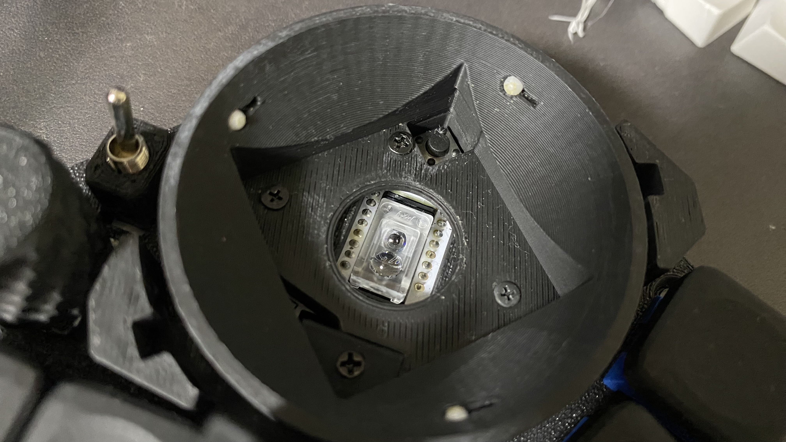

すると以下のように"XIAO-SENSE(E:)"というようにフォルダが開きます。  
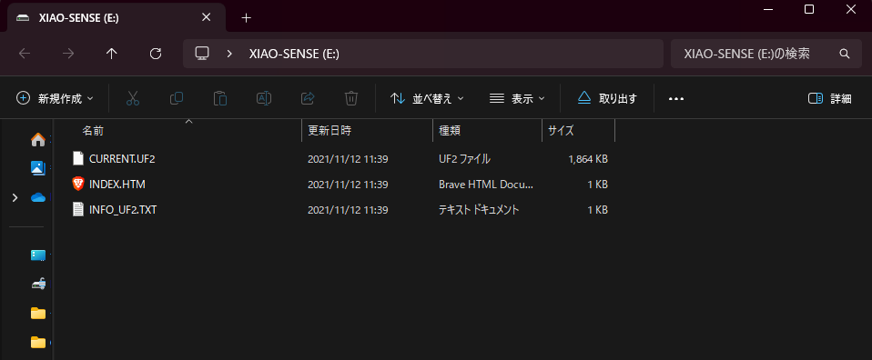

ここにMoooseMiniのソフトファイル(MoooseMini-seeeduino_xiao_ble-zmk.uf2)をドラッグ＆ドロップしてください。  
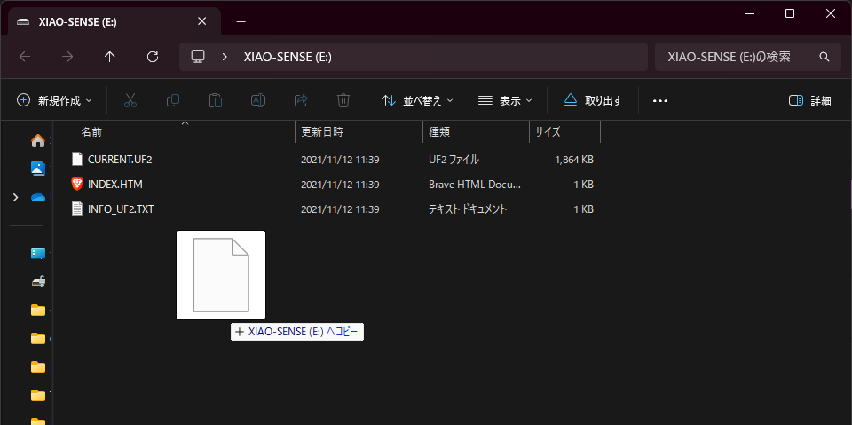

ドラッグ＆ドロップすると自動でウィンドウが閉じます。  
(USBデバイスモードからソフト書き込みによってマウスとして認識されなおすために、USBデバイスが抜かれたのと同じ状態になる挙動です。)  

```
まれに以下のようなポップアップが出るようです。  
これは自動でデバイス接続が外れるために生じるそうですが、書き込みはできているようです。スキップしてください。  
もし、うまく書き込めていなさそうな場合はMoooseMiniのuf2を上記のソフト書き込み手順に従いもう一度書き込みをしてみてください。  
もしくは、一度Xiaoのリセットuf2ファイルを書き込み、その後、再度MoooseMiniのuf2を書き込んでみてください。  
```
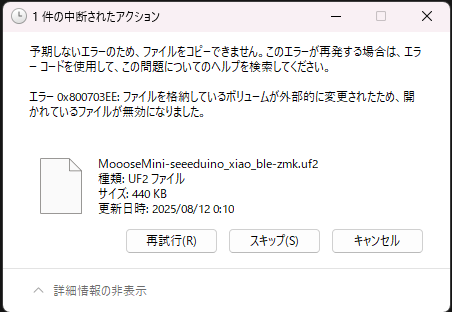

ここから以下はソフトが書き込まれた前提でのビルドガイドになります。  

## インジケータについて
電源を入れたら、2回マイコンのLEDが光ります。
1回目がバッテリーの充電状態を示しており、2回目がBluetooth接続状態を示しています。

### バッテリーの充電状態
青：十分充電あり  
黄：充電少なくなってきているよ  
赤：充電かなり少ない  

USB接続した状態で電源スイッチをONするとバッテリーに充電されます。  

**注意：バッテリーへの過度な充電を防ぐため、バッテリー充電状態で放置しないでください。**  

自身が使用して目が届いている範囲内でバッテリー充電をしてください。  

### Bluetooth接続状態
青：接続状態  
黄：ペアリング待ち状態  
赤：未接続状態  

Bluetooth接続の仕方は後述の[Bluetooth接続の仕方](#bluetooth接続の仕方)を確認ください。  

## キーマップの変更
方法は2種類あります。  
主にZMK Studioを使用する場合をメインに説明します。
Webブラウザ上で完結するためキーマップを簡単に編集可能です。  

### ZMK Studioを使用する場合
USB接続した上で https://zmk.studio にアクセスしてください。  
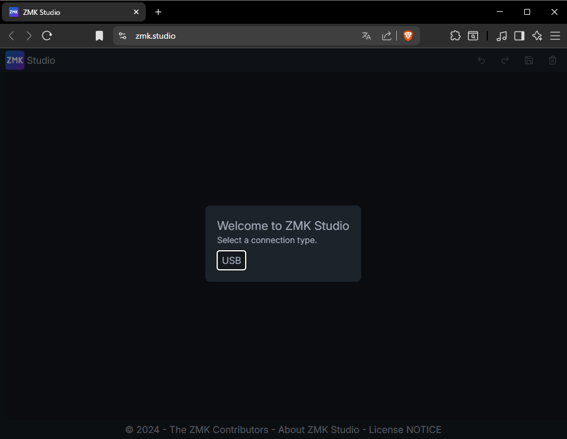

「USB」をクリックするとポップアップが表示されます。  
MoooseMiniを選択し、"接続"をクリックしてください。  
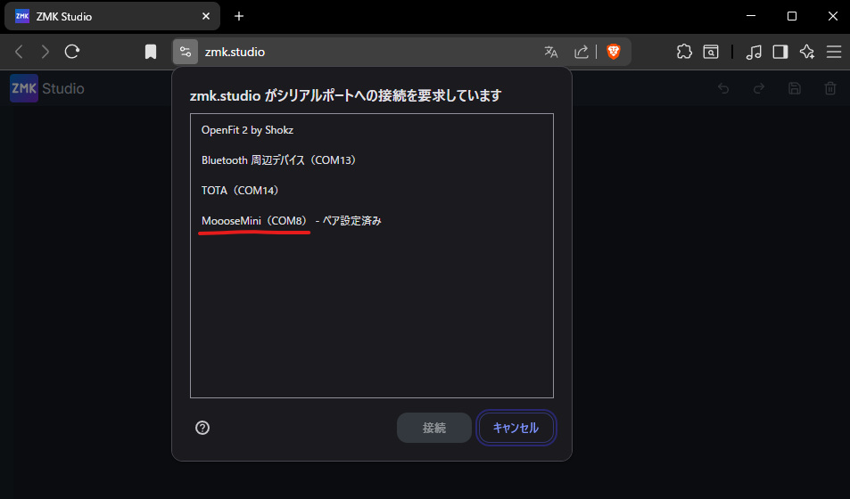

設定画面が表示されます。レイヤーは0～4の5つです。  
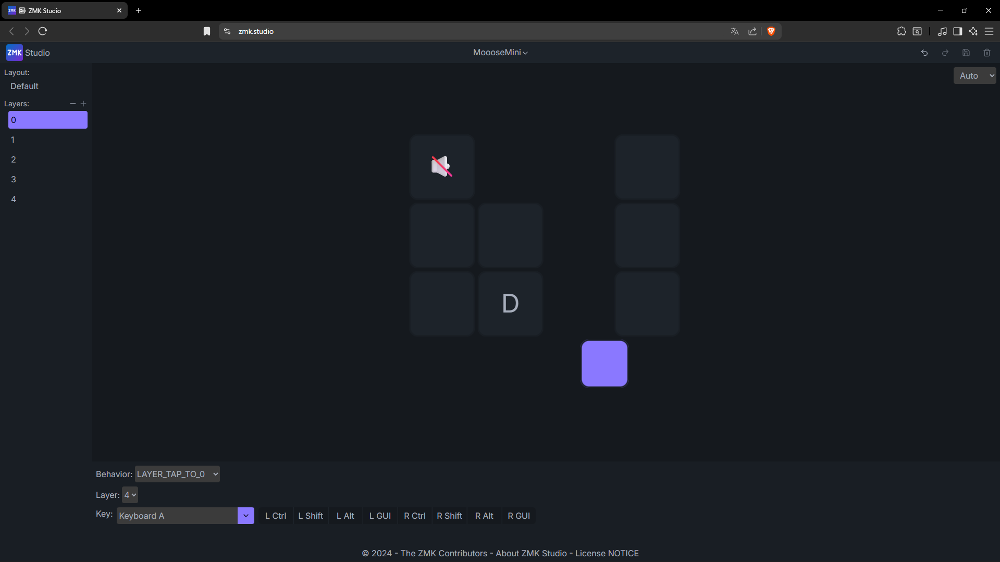

何も設定されていない空白のように見えますが、クリックしてみると実は設定されていることがわかります。  
下の画像では"Mouse Key Press"の"MB1"、つまり左クリックが設定されています。  
このBehaviorについては[ZMKのドキュメント(Behaviors)](https://zmk.dev/docs/keymaps/behaviors)をご確認ください。  
例えば文字を設定したい場合は[KeyBoardのページ](https://zmk.dev/docs/keymaps/list-of-keycodes#keyboard)です。  
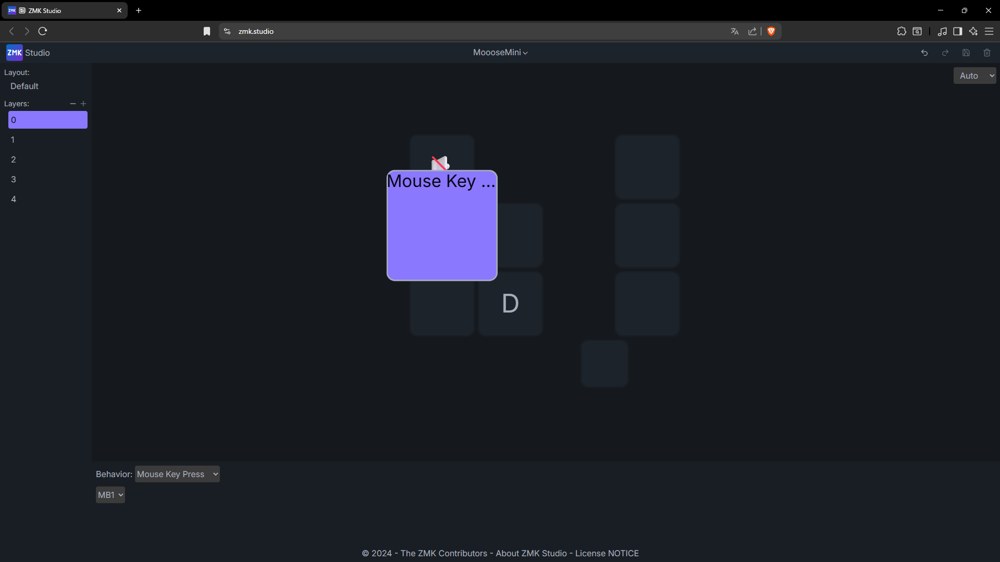

「Behaviorでカテゴリを選択し、そのカテゴリ内の設定値を指定する」だと伝わりやすいでしょうか。  
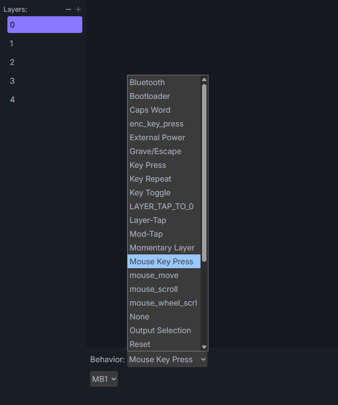
"Mouse Key Press"だと他に右クリック(MB2)やミドルクリック(MB3)など選択可能です。  
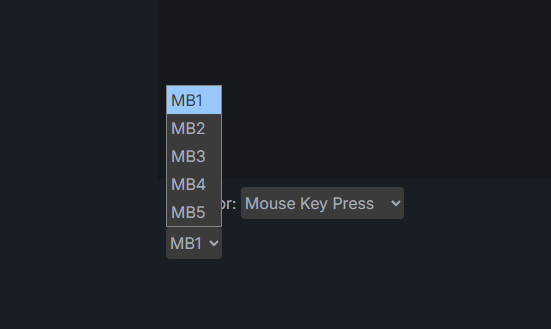

"押している間レイヤーを切換える設定"もあります。  
Behaviorの"LAYER_TAP_TO_0"ですと、長押し時に指定したLayer、短押し時に指定したKeyが設定できます。  
下の画像ですと、長押し時にLayer1になり、短押し時に"Y"が入力されます。  
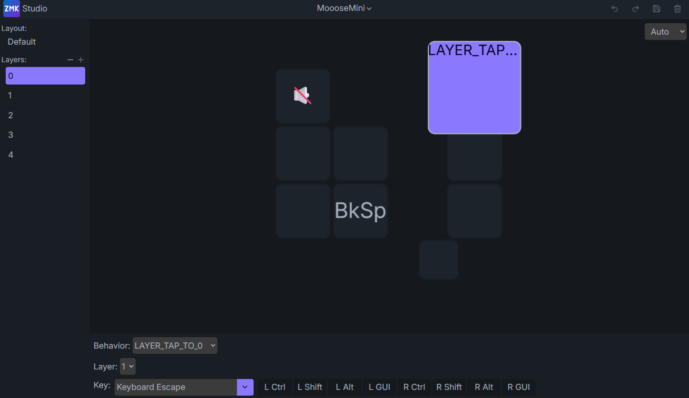

### ZMK Firmwareを使用する場合
[MoooseMiniのZMK FirmwareのGithubリポジトリ](https://github.com/ataruno/zmk-MoooseMini)をForkしてください。  
Github上でキーマップを編集しコミットすると、Github Action上でビルドされ書き込みファイルが生成されます。  

## Bluetooth接続の仕方
初期のキーマップではBluetooth接続のレイヤーはLayerの4に設定しています。  
また、タクトスイッチを押し続けるとLayer4になります。  
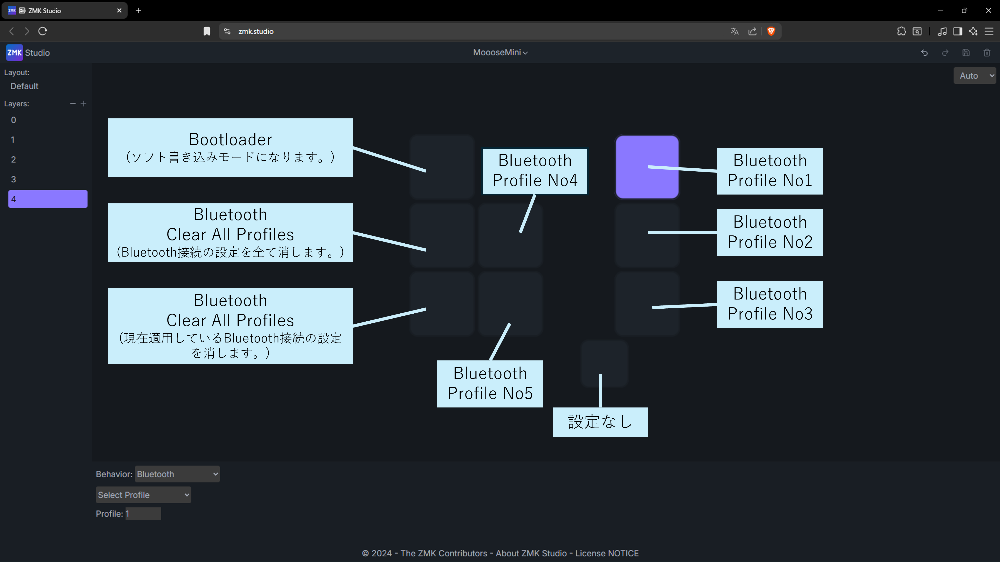

初めてソフトを書き込んだ時点では、どのBluetoothプロファイルも設定されていない状態です。  
No1にPCを接続したい場合。  
MoooseMiniのプロファイル1を選択(=タクトスイッチを押してレイヤ4にしながら右奥のスイッチを押す)。  
Xiaoマイコンのインジケータが黄色(接続設定待ち状態=ペアリング待ち状態)になるはずです。  
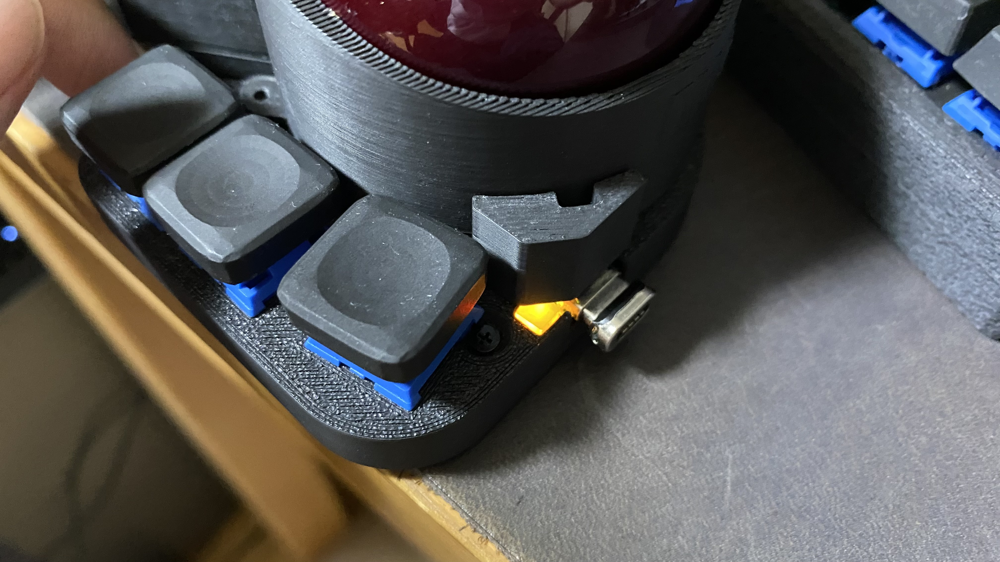

次にPCのデバイスの追加からBluetooth接続機器を探し、MoooseMiniを接続してください。
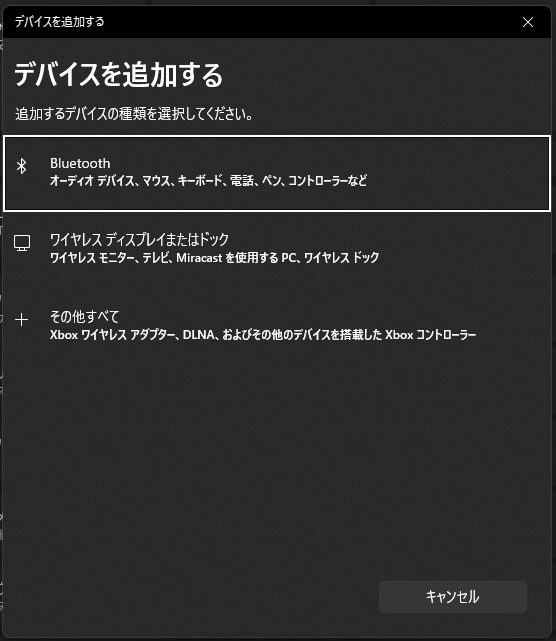

MoooseMiniのインジケータが青色になれば無線接続状態です。  
また、ペアリングした機器の電源が入っていない場合など接続していない場合は赤色が表示されます。  
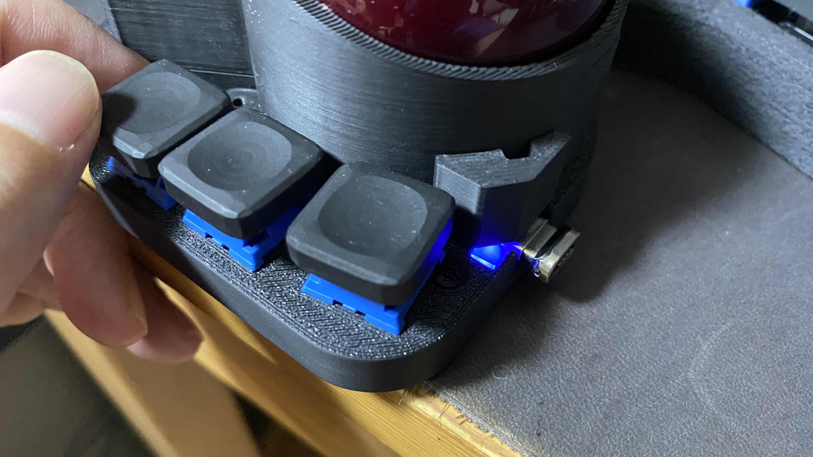


